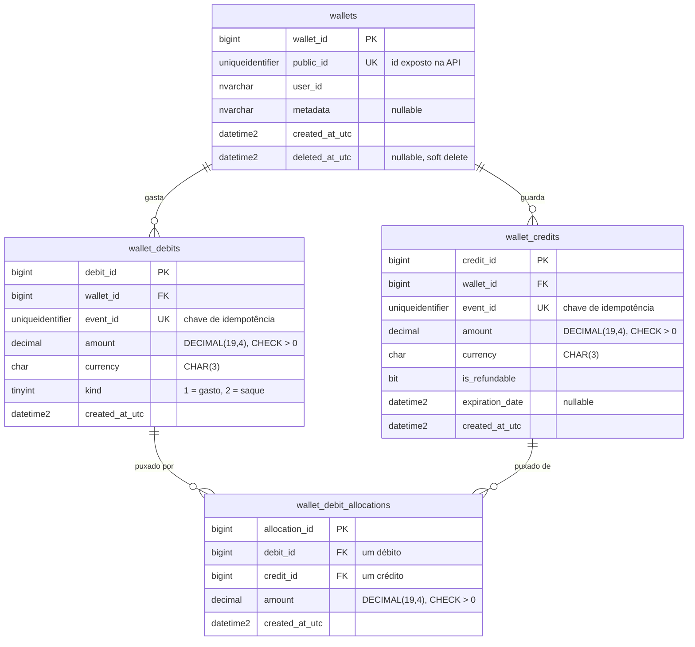

# Wallet / Sistema de Crédito de Loja

[](https://github.com/brenoPellegrino/wallet-store-credit/actions/workflows/ci.yml)


[](LICENSE)

[English](README.md) · **Português (Brasil)**

Um serviço autônomo de carteira e crédito de loja. É uma Web API em C# / .NET 8 apoiada por SQL
Server, escrita para mostrar profundidade em **SQL, ADO.NET puro e stored procedures** nos caminhos
que movem dinheiro.

A parte interessante deste projeto não é a superfície da API, é o que acontece por baixo: um livro
razão somente-inserção (append-only), operações de dinheiro idempotentes, um débito seguro sob
concorrência, uma transação no cliente para transferências e um índice de cobertura cujo valor é
medido, não presumido.

## Sumário

- [O que faz](#o-que-faz)
- [Início rápido](#início-rápido)
- [Arquitetura](#arquitetura)
- [O modelo de dados](#o-modelo-de-dados)
- [Os caminhos do dinheiro e suas garantias](#os-caminhos-do-dinheiro-e-suas-garantias)
- [Stored procedures](#stored-procedures)
- [Quando usar uma stored procedure](#quando-usar-uma-stored-procedure)
- [Segurança: dois logins de banco](#segurança-dois-logins-de-banco)
- [Versionamento de schema](#versionamento-de-schema)
- [Desempenho: o índice de cobertura, medido](#desempenho-o-índice-de-cobertura-medido)
- [API](#api)
- [Testes e CI](#testes-e-ci)
- [Decisões principais](#decisões-principais)
- [Executando localmente](#executando-localmente)
- [Estrutura do repositório](#estrutura-do-repositório)
- [Licença](#licença)

## O que faz

Uma carteira guarda crédito de loja como um conjunto de pequenas "sacolas" (bags). Cada sacola de
**crédito** carrega o próprio valor, moeda e uma expiração opcional. Gastar dinheiro (um **débito**)
consome uma ou mais sacolas em uma ordem definida, e o registro de quanto um débito tirou de cada
sacola vive em uma tabela de alocações. Uma **transferência** move dinheiro entre duas carteiras. Os
saldos são derivados do livro razão por moeda, nunca guardados em uma coluna mutável.

Tudo que muda dinheiro é **append-only**: linhas são inseridas, nunca atualizadas ou apagadas, então
o histórico completo é sempre reconstruível.

## Início rápido

O sistema inteiro roda a partir do Docker, sem precisar instalar .NET ou SQL Server localmente:

```bash
cp .env.example .env          # defina uma MSSQL_SA_PASSWORD forte
docker compose --profile app up --build
```

Depois abra **http://localhost:8080/swagger** e percorra o fluxo: crie uma carteira, credite,
debite, transfira para outra carteira, e leia o saldo e o extrato.

O SQL Server não tem build nativo para Apple Silicon, então em arm64 ele roda a imagem x64 sob
emulação. Isso é suficiente para desenvolvimento. A imagem da API é nativa para o host.

## Arquitetura

Três projetos, com uma direção de dependência limpa (`Api -> Infrastructure -> Core`):

| Projeto | Responsabilidade |
|---|---|
| `Wallet.Core` | Domínio: o tipo de valor `Money`, modelos, o contrato `IWalletRepository`, erros. Sem infraestrutura. |
| `Wallet.Infrastructure` | Acesso a dados em ADO.NET puro, as chamadas de stored procedure, e o executor de migrações. |
| `Wallet.Api` | Web API ASP.NET Core (controllers), contratos de request/response, mapeamento de erros. |

**Não há ORM.** Todo caminho é ADO.NET puro (`SqlConnection`, `SqlCommand`, `SqlDataReader`,
`SqlTransaction`). As mutações de dinheiro passam por stored procedures; as leituras são SQL escrito
à mão. Essa é uma escolha deliberada para que a única leitura interessante, o agregado de saldo, fique
escrita à mão e determinística para o estudo de desempenho (veja a
[ADR 0001](docs/adr/0001-no-orm-raw-ado-net.md)).

## O modelo de dados

Quatro tabelas, todas append-only exceto por um marcador de soft-delete em `wallets`. O desenho
completo e o raciocínio por trás de cada coluna, chave e constraint está em
[`docs/schema.md`](docs/schema.md).



- **`wallets`** é a raiz do agregado e a linha travada para serializar débitos.
- **`wallet_credits`** é uma linha por sacola: valor, moeda, marcador de reembolsável, expiração opcional.
- **`wallet_debits`** é uma linha por pedido de gasto.
- **`wallet_debit_allocations`** registra, por par (débito, sacola), quanto um débito tirou de uma sacola.

Dois valores derivados são calculados a partir dessas linhas, nunca guardados:

- O valor **restante** de uma sacola é o seu valor menos a soma de suas alocações.
- O **saldo por moeda** de uma carteira é a soma do valor restante sobre suas sacolas não expiradas.

Dinheiro é `DECIMAL(19,4)` no banco e `decimal` em C#, nunca `float`. A expiração é tratada por um
filtro em tempo de leitura (`expiration_date IS NULL OR expiration_date > @now`), então uma sacola
para de contar no instante em que expira, sem job e sem escrita.

## Os caminhos do dinheiro e suas garantias

- **Idempotência.** Todo crédito, débito e transferência carrega um `event_id` fornecido pelo cliente
  com uma constraint de unicidade. Um pedido repetido ou em corrida é detectado e o resultado original
  é retornado, então um retry nunca aplica duas vezes. Uma transferência usa o mesmo `event_id` para o
  seu débito e o seu crédito, o que também correlaciona as duas linhas.
- **Segurança sob concorrência.** Dois débitos na mesma carteira não podem ambos ler o mesmo saldo
  disponível e estourar uma sacola. Cada débito primeiro toma um update lock (`UPDLOCK, HOLDLOCK`) na
  linha da carteira, então os débitos em uma carteira serializam enquanto os débitos em carteiras
  diferentes ainda rodam em paralelo. Isso é provado por
  [`WalletConcurrencyTests`](tests/Wallet.IntegrationTests/WalletConcurrencyTests.cs)
  (`Concurrent_full_balance_debits_let_exactly_one_win` e `Concurrent_partial_debits_never_overspend`),
  que disparam muitos débitos no mesmo instante e verificam que o dinheiro fecha. Transferências travam
  duas carteiras, então usam **travamento ordenado** (sempre o menor `public_id` primeiro) para evitar
  o clássico deadlock `A -> B` / `B -> A`. Um teste de estresse expôs deadlocks reais (erro 1205) antes
  dessa correção, e confirma que não há nenhum depois.
- **Transações ACID.** Cada operação de dinheiro individual roda em uma transação que faz commit por
  inteiro ou rollback. Uma **transferência** vai além: abre uma `SqlTransaction` no cliente em C# e roda
  o débito da origem e o crédito do destino dentro dela, então os dois fazem commit juntos ou nenhum.
  Se o destino não existir, o débito já executado sofre rollback e a origem mantém o saldo completo.

## Stored procedures

As mutações de dinheiro são stored procedures, chamadas por ADO.NET:

- **`usp_CreditWallet`** adiciona uma sacola de crédito, idempotente no `event_id` (uma duplicata em
  corrida é capturada pelo índice único e reportada como replay).
- **`usp_DebitWallet`** gasta de uma carteira. Toma o lock da linha da carteira, seleciona as sacolas
  candidatas (moeda certa, não expiradas, apenas reembolsáveis para um saque) em ordem de expiração mais
  antiga primeiro, e calcula quanto tirar de cada uma com um total corrente baseado em conjunto (set-based).
  Se as sacolas não cobrem o valor, ela lança erro e o débito inteiro sofre rollback. Retorna a linha do
  débito e suas alocações.
- **`usp_GetWalletStatement`** lista os créditos e débitos de uma carteira como movimentos em ordem de tempo.

As definições vivem em [`db/migrations`](db/migrations) como scripts numerados.

## Quando usar uma stored procedure

Stored procedures não são o padrão aqui. As leituras são SQL escrito à mão, e um insert simples como
criar uma carteira também é SQL puro. Apenas as mutações de dinheiro são procedures, por duas razões
concretas que este projeto tornou tangíveis.

**1. Para manter uma operação complexa, concorrente e de múltiplos comandos atômica e no servidor.**
`usp_DebitWallet` justifica procedures sozinha. Um débito não é um comando só: ele trava a linha da
carteira, seleciona as sacolas candidatas (moeda certa, não expiradas, apenas reembolsáveis para um
saque) da mais antiga primeiro, calcula quanto tirar de cada uma com um total corrente baseado em
conjunto, insere o débito e suas alocações, e lança erro se as sacolas não cobrem o valor. Tudo isso
precisa ser uma unidade atômica sob um lock. Feito a partir da aplicação, seriam várias idas e voltas
à rede com uma transação e seus locks segurados abertos o tempo todo. Como procedure, roda em uma
única chamada, então a seção crítica fica no servidor e os locks são segurados por microssegundos em
vez de milissegundos. Os testes de concorrência, que disparam muitos débitos no mesmo instante, passam
por causa disso.

**2. Como uma fronteira de menor privilégio, defesa em profundidade.**
Como uma procedure e as tabelas que ela toca compartilham o dono `dbo`, o encadeamento de propriedade
(ownership chaining) permite que o login de runtime execute a procedure com apenas `EXECUTE` e nenhum
grant direto na tabela. Então uma conexão de aplicação comprometida não consegue rodar
`DELETE FROM wallet_credits`: ela simplesmente não tem o direito de `DELETE`. Isso é defesa em
profundidade, não a defesa principal contra SQL injection (ADO.NET parametrizado já cobre isso), mas é
uma segunda parede real em volta do livro razão do dinheiro. Veja
[Segurança: dois logins de banco](#segurança-dois-logins-de-banco).

**A lição que este projeto ensinou.** Eu primeiro concedi ao login de runtime apenas `EXECUTE`,
esperando que as procedures fossem a história toda. Os testes de integração falharam na hora: as
leituras em SQL puro e o `CreateWalletAsync` ainda precisavam de `SELECT` e `INSERT`. O benefício de
menor privilégio das procedures é real, mas é tudo ou nada: você só tem um login somente-`EXECUTE` se
todo caminho passar por uma procedure. Aqui a leitura de saldo é deliberadamente escrita à mão e
tunada (veja [Desempenho](#desempenho-o-índice-de-cobertura-medido)), então o login mantém um conjunto
estreito de grants em tabelas e o livro razão do dinheiro continua com escrita somente por procedure.

**Quando não usar.** Criar uma carteira é um insert de uma linha só, sem invariante a proteger e sem
concorrência a serializar, então continua SQL puro. Embrulhar comandos triviais em procedures espalha
a lógica entre a aplicação e o banco sem ganho. Uma procedure merece o seu lugar quando protege um
invariante, serializa acesso, ou junta uma operação de múltiplos comandos em uma única chamada atômica.

## Segurança: dois logins de banco

O banco é acessado por dois logins de SQL Server com privilégios diferentes, então a aplicação nunca
roda com direitos de que não precisa.

- **As migrações** rodam sob um login privilegiado (`sa` em desenvolvimento), a partir de
  `WalletDatabase:MigrationConnectionString`, porque emitem DDL e criam o login de runtime.
- **A API em runtime** usa um login `wallet_app` separado, a partir de
  `WalletDatabase:ConnectionString` e criado pela migração `006`. Quando nenhuma connection string de
  migração é definida, ele cai de volta para a de runtime, então um setup de login único ainda funciona.

`wallet_app` recebe grant apenas do que o acesso a dados de runtime realmente usa:

| Objeto | Grant | Usado por |
|---|---|---|
| `usp_CreditWallet`, `usp_DebitWallet`, `usp_GetWalletStatement` | `EXECUTE` | crédito, débito, transferência, extrato |
| `wallets` | `SELECT`, `INSERT` | buscar carteira, leitura de saldo, lock de transferência, criar carteira |
| `wallet_credits` | `SELECT` | leitura de saldo |
| `wallet_debit_allocations` | `SELECT` | leitura de saldo |

Ele não tem DDL e nenhum `UPDATE` ou `DELETE` em lugar nenhum, o que combina com o desenho append-only.
Todo crédito e débito passa por uma procedure, então o login não tem escrita direta no livro razão do
dinheiro, e não consegue tocar em `wallet_debits` de jeito nenhum, exceto lendo um extrato por
`usp_GetWalletStatement`.

## Versionamento de schema

Um **executor de migrações** em ADO.NET feito à mão aplica scripts `.sql` numerados (tabelas,
procedures e índices) em ordem, cada um dentro da sua própria `SqlTransaction`. Ele registra cada
script aplicado em `__schema_versions` com um checksum SHA-256, e re-verifica esse checksum em execuções
posteriores, então uma migração editada falha de forma barulhenta. Ele também cria o banco de destino na
primeira execução, então um SQL Server novo não precisa de setup manual. A API aplica as migrações
pendentes no startup.

## Desempenho: o índice de cobertura, medido

A leitura de saldo é um agregado por moeda filtrado por expiração. Um índice de cobertura,
`IX_wallet_credits_wallet_currency_expiration` em `(wallet_id, currency, expiration_date)` com
`INCLUDE (amount, is_refundable)`, atende a ela (e ao scan de alocação do débito).

O valor é medido, não presumido. Contra 100.000 sacolas de crédito em 200 carteiras, para o saldo de
uma carteira:

| | Operador em `wallet_credits` | leituras lógicas |
|---|---|---|
| Antes | Clustered Index **Scan** | **563** |
| Depois | Index **Seek** | **6** |

O custo do scan cresce com o número total de linhas; o custo do seek acompanha só as sacolas da própria
carteira. Estudo completo e como reproduzi-lo:
[`docs/execution-plans/balance-query.md`](docs/execution-plans/balance-query.md) e
[`db/perf/balance_plan_study.sql`](db/perf/balance_plan_study.sql).

## API

| Método | Rota | Propósito |
|---|---|---|
| `POST` | `/wallets` | Criar uma carteira |
| `GET` | `/wallets/{id}` | Buscar uma carteira |
| `POST` | `/wallets/{id}/credits` | Creditar (dinheiro entra), idempotente no `eventId` |
| `POST` | `/wallets/{id}/debits` | Debitar (dinheiro sai), 409 em fundos insuficientes |
| `GET` | `/wallets/{id}/balances` | Saldo por moeda |
| `GET` | `/wallets/{id}/statement` | Histórico de movimentos |
| `POST` | `/transfers` | Mover dinheiro entre duas carteiras, em uma transação |
| `GET` | `/health`, `/health/db` | Liveness e prontidão do banco |

Os erros são retornados como `ProblemDetails`: 400 para entrada inválida, 404 para uma carteira
inexistente, 409 quando um débito ou transferência não pode ser coberto.

## Testes e CI

- **Testes de unidade** (`Wallet.UnitTests`) cobrem o tipo `Money`, sem precisar de banco.
- **Testes de integração** (`Wallet.IntegrationTests`) rodam contra um SQL Server real através de um
  host em memória, e cobrem replay idempotente, rollback de saldo negativo, alocação da mais antiga
  primeiro, concorrência, commit e rollback de transferência, e a superfície HTTP. Eles se pulam de
  forma limpa quando o SQL Server não está acessível, então a suíte fica verde sem um banco.
- **CI** (`.github/workflows/ci.yml`) compila e roda a suíte inteira em todo pull request, com SQL
  Server 2022 como service container. O check `build-and-test` é obrigatório em `main` e `dev`, então
  nada faz merge vermelho. Não há CD: o projeto não é implantado em lugar nenhum.

## Decisões principais

As decisões maiores são registradas como ADRs:

- [ADR 0001: ADO.NET puro em tudo, sem ORM](docs/adr/0001-no-orm-raw-ado-net.md)
- [ADR 0002: SQL Server no Docker](docs/adr/0002-sql-server-in-docker.md)

O plano de construção e o histórico de milestones está em [`PLAN.md`](PLAN.md).

## Executando localmente

Pré-requisitos: Docker, e o SDK do .NET 8 se você quiser rodar a API fora de um container.

```bash
cp .env.example .env                        # defina MSSQL_SA_PASSWORD
cp src/Wallet.Api/appsettings.Development.json.example \
   src/Wallet.Api/appsettings.Development.json   # ponha sua senha do SA em MigrationConnectionString

# Opção A: o sistema inteiro no Docker (sem precisar de .NET)
docker compose --profile app up --build     # -> http://localhost:8080/swagger

# Opção B: banco no Docker, API no host (loop de dev rápido)
docker compose up -d
dotnet run --project src/Wallet.Api

# Testes (precisam do banco no ar)
docker compose up -d
dotnet test

# O estudo de plano de execução
docker exec -i wallet-sqlserver /opt/mssql-tools18/bin/sqlcmd \
  -S localhost -U sa -P "$MSSQL_SA_PASSWORD" -C -W \
  < db/perf/balance_plan_study.sql
```

## Estrutura do repositório

```
wallet/
  README.md                   este documento, em inglês
  README.pt-br.md             este documento, em português do Brasil
  PLAN.md                     plano de construção e milestones
  docker-compose.yml          SQL Server, e a API atrás do profile "app"
  docs/                       schema.md, execution-plans/, adr/
  db/
    migrations/               tabelas, procedures e índices numerados (fonte única da verdade)
    perf/                     o estudo de plano de execução
  src/
    Wallet.Api/               Web API ASP.NET Core
    Wallet.Core/              domínio: Money, modelos, interfaces, erros
    Wallet.Infrastructure/    acesso a dados em ADO.NET + executor de migrações
  tests/
    Wallet.UnitTests/         xUnit, sem banco
    Wallet.IntegrationTests/  xUnit contra SQL Server (Docker)
```

## Licença

Publicado sob a [Licença MIT](LICENSE).
